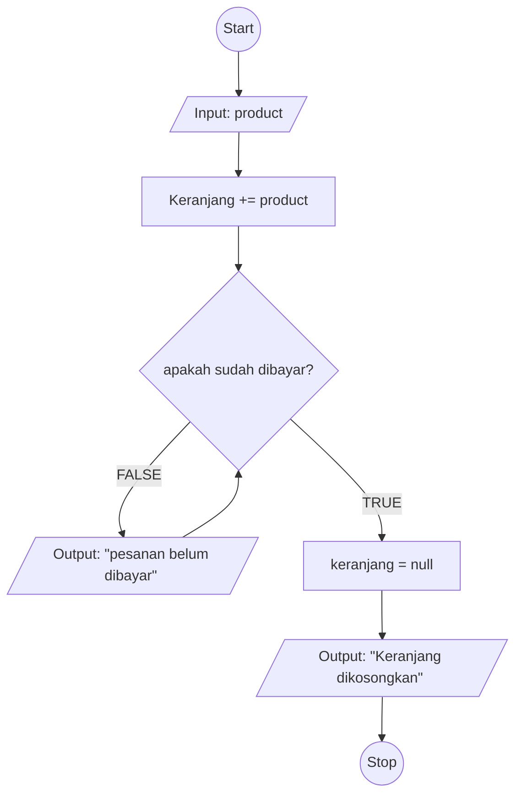

# Minitask

### membuat algoritma menambahkan keranjang di ecommerce

1. Mulai
2. masukkan nama produk dengan mengetikkan keyword tertentu
3. cari produk berdasarkan keyword yang ditulis
4. tampilkan 10 produk yang memiliki kesamaan dengan keyword
5. tampilkan informasi : ID produk, nama produk, deskripsi, gambar, dan tombol tambah keranjang
6. pilih salah satu produk untuk ditambahkan ke keranjang dengan menekan tombol tambah keranjang
7. validasi stok ke dalam database pada produk yang dipilih
8. apabila stok tersedia, tambahkan produk ke dalam keranjang
9. apabila stok tidak tersedia, tampilkan pesan, "produk tidak tersedia"
10. tanyakan kepada user apakah ingin melanjutkan checkout
11. apabila user menyatakan bersedia, lanjutkan ke tahap selanjutnya
12. lanjutkan ke tahap pembayaran
13. Selesai

