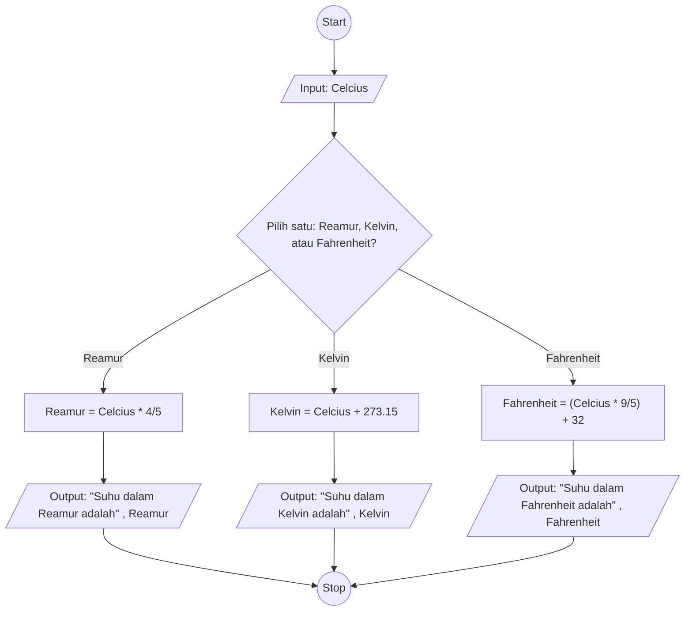

## Minitask 

## buat algoritma deskriptif yang mengonversi suhu dari celcius ke kelvin, reamur, dan fahrenheit

1. Mulai
2. Masukkan suhu celcius
3. tampilkan, "suhu dalam reamur adalah"
4. kalikan suhu celcius dengan 4/5
5. tampilkan, "suhu dalam Kelvin adalah"
6. tambahkan suhu celcius dengan 273,15
7. tampilkan, "suhu dalam Fahrenheit adalah"
8. kalikan suhu celcius dengan 9/5 dan tambahkan dengan 32
9. selesai

