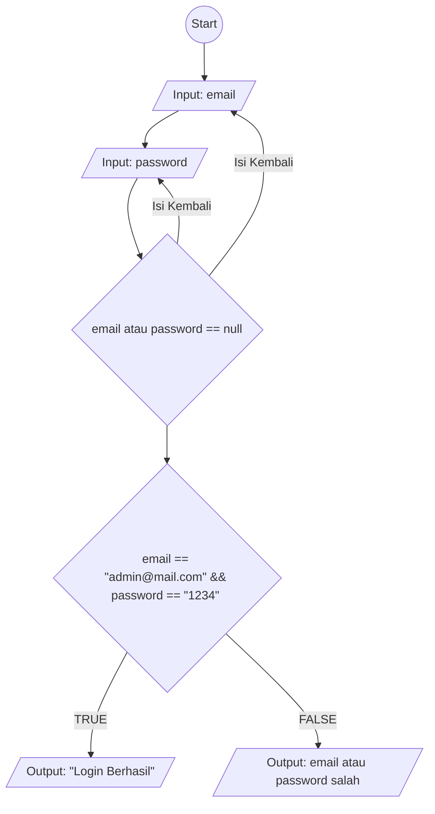

```mermaid
flowchart TD

 A@{ shape: circle, label: "Start" } -->B --> C

 B@{ shape: lean-r, label: "Input: email" } 

 C@{ shape: lean-r, label: "Input: password" } --> D

 D@{ shape: diamond, label: "email atau password == null" } --> |Isi Kembali| B & C 
 
 Z@{ shape: diamond, label: "email == \"admin@mail.com\" && password == \"1234\" " }  
 
 Z -- TRUE --> G 
 Z -- FALSE --> H

 D --> Z

 G@{ shape: lean-r, label: "Output: \"Login Berhasil\" " } 
 H@{ shape: lean-r, label: "Output: email atau password salah" } 
```