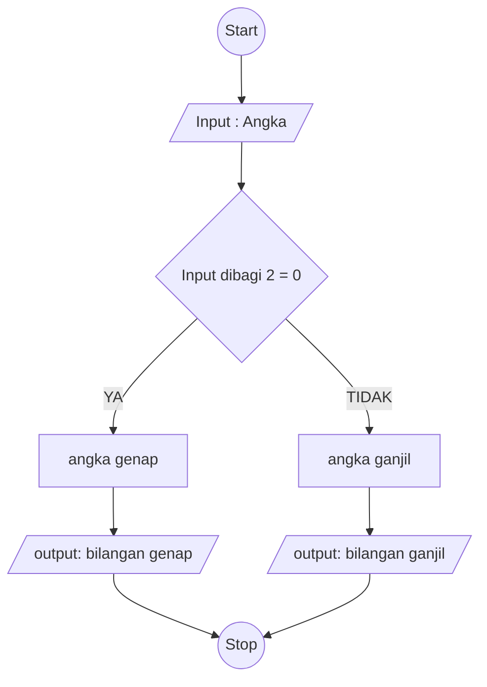

```mermaid
flowchart TD
    A@{ shape: circle, label: "Start" } -->C

    C@{ shape: lean-r, label: "Input : Angka" } --> E

    E@{ shape: diamond, label: "Input dibagi 2 = 0" } 

    E -- YA --> G

    E -- TIDAK --> F

    G@{ shape: rect, label: "angka genap" } --> H

    F@{ shape: rect, label: "angka ganjil" } --> I

    H@{ shape: lean-r, label: "output: bilangan genap"} --> B

    I@{ shape: lean-r, label: "output: bilangan ganjil"} --> B


    B@{ shape: circle, label: "Stop" }

```
