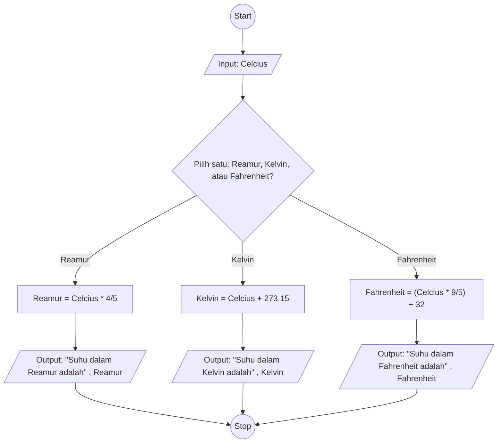

```mermaid
flowchart TD

    A@{ shape: circle, label: "Start" } --> 
    B@{ shape: lean-r, label: "Input: Celcius" } --> F
    C@{ shape: rect, label: "Reamur = Celcius * 4/5" }
    D@{ shape: rect, label: "Kelvin = Celcius + 273.15" }
    E@{ shape: rect, label: "Fahrenheit = (Celcius * 9/5) + 32" }    
   
    F@{ shape: diamond, label: "Pilih satu: Reamur, Kelvin, atau Fahrenheit?" } 

    X@{ shape: lean-r, label: "Output: \"Suhu dalam Reamur adalah\" , Reamur" }
    Y@{ shape: lean-r, label: "Output: \"Suhu dalam Kelvin adalah\" , Kelvin" }
    Z@{ shape: lean-r, label: "Output: \"Suhu dalam Fahrenheit adalah\" , Fahrenheit" }
   
    F -- "Reamur" --> C --> X --> J
    F -- "Kelvin" --> D --> Y --> J
    F -- "Fahrenheit" --> E --> Z --> J

    J@{ shape: circle, label: "Stop" } 

 
```