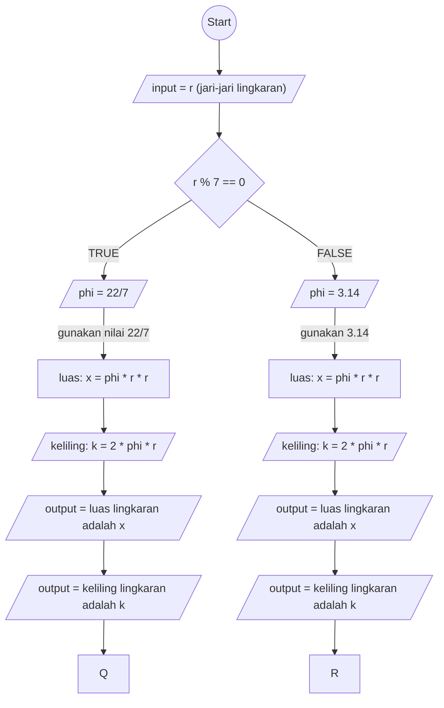

```mermaid
flowchart TD
 A@{ shape: circle, label: "Start" } --> B

 B@{ shape: lean-r, label: "input = r (jari-jari lingkaran)"} --> C

 C@{ shape: diamond, label: "r % 7 == 0"}

 C -- TRUE --> E

 C -- FALSE --> F

 E@{ shape: lean-r, label: "phi = 22/7"} -->|gunakan nilai 22/7| G 
 F@{ shape: lean-r, label: "phi = 3.14"}--> |gunakan 3.14| H

 G@{ shape: rect, label: "luas: x = phi * r * r"} --> A1
 H@{ shape: rect, label: "luas: x = phi * r * r"} --> B1

 A1@{ shape: lean-r, label: "keliling: k = 2 * phi * r"} --> L
 B1@{ shape: lean-r, label: "keliling: k = 2 * phi * r"} --> M

 L@{ shape: lean-r, label: "output = luas lingkaran adalah x"} --> O
 M@{ shape: lean-r, label: "output = luas lingkaran adalah x"} --> P

 O@{ shape: lean-r, label: "output = keliling lingkaran adalah k"} --> Q
 P@{ shape: lean-r, label: "output = keliling lingkaran adalah k"} --> R


```
