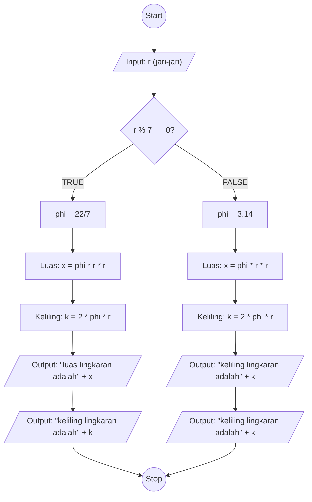

```mermaid
flowchart TD
 A@{ shape: circle, label: "Start" } --> B

 B@{ shape: lean-r, label: "Input: r (jari-jari)" } --> C

 C@{ shape: diamond, label: "r % 7 == 0?" }

 C -- TRUE --> E
 C -- FALSE --> F

 E@{ shape: rect, label: "phi = 22/7" } --> G 
 F@{ shape: rect, label: "phi = 3.14" } --> H

 G@{ shape: rect, label: "Luas: x = phi * r * r" } --> A1
 H@{ shape: rect, label: "Luas: x = phi * r * r" } --> B1

 A1@{ shape: rect, label: "Keliling: k = 2 * phi * r" } --> L
 B1@{ shape: rect, label: "Keliling: k = 2 * phi * r" } --> M

 L@{ shape: lean-r, label: "Output: \"luas lingkaran adalah\" + x" } --> O
 M@{ shape: lean-r, label: "Output: \"keliling lingkaran adalah\" + k" } --> P

 O@{ shape: lean-r, label: "Output: \"keliling lingkaran adalah\" + k" } --> Z
 P@{ shape: lean-r, label: "Output: \"keliling lingkaran adalah\" + k" } --> Z

 Z@{ shape: circle, label: "Stop" } 
```

